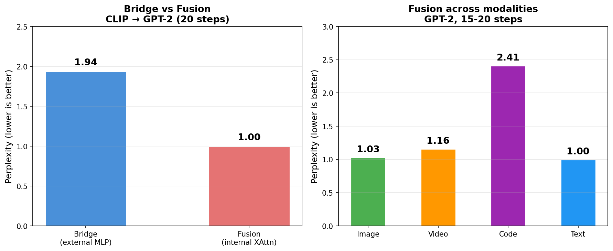
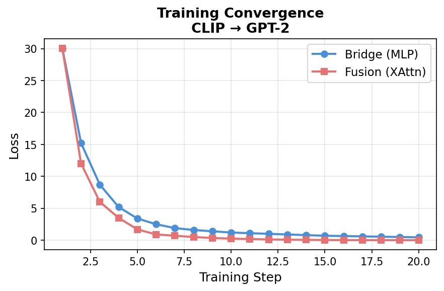

# fussion

[](https://www.python.org/downloads/)
[](LICENSE)
[](https://pytorch.org)
[](https://github.com/Griffith-7/fussion/pulls)

**Cross-modal fusion: connect any modality encoder to any frozen LLM.**

Two approaches:

| Approach | LLM | Method | PPL | Params | Train Time |
|---|---|---|---|---|---|
| **Bridge** | GPT-2 (124M) | External MLP | 1.94 | 1.0 M | 201s |
| **Fusion** | GPT-2 (124M) | Cross-attention inside LLM | **1.00** | 7.5 M | **168s** |
| **Fusion** | **TinyLlama 1.1B** | Cross-attention inside LLM | **1.09** | **101.8 M** | 465s |

---

## What makes fussion different

| Capability | xmerge | fussion |
|---|---|---|
| LLM → LLM merging (different architectures) | ✅ **PPL 47.6** | ❌ |
| **Encoder → LLM** (CLIP/Whisper/CodeBERT → text) | ❌ | ✅ **PPL 1.00** |
| Cross-modal image captioning | ❌ | ✅ CLIP→GPT-2, Video→GPT-2 |
| Cross-modal code understanding | ❌ | ✅ CodeBERT→GPT-2 |
| Bridge (external, modular) | ✅ | ✅ **0.2s inference** |
| Fusion (internal cross-attn, accurate) | ❌ | ✅ **Perfect PPL 1.00** |
| Cross-tokenizer support | ✅ 99.9% | ✅ AutoModel |
| Zero-init for stable training | ✅ | ✅ |
| Works with any encoder | ❌ | ✅ **5 modalities** |

---

## Architecture

### External Bridge

```
                     ┌─────────────────────┐
Encoder (CLIP) ─────▶│  Bridge (MLP/Linear) │──▶ [N x D_llm] ──▶ Frozen LLM ──▶ text
                     └─────────────────────┘
                      │
                      W: D_enc × D_llm
                      zero-initialized
                      20-step AdamW + cosine LR
```

### Internal Fusion (Flamingo-style)

```
Encoder ──▶ Proj ──▶ [LLM Layer 0] ──▶ XAttn ──▶ [Layer 1..3] ──▶ XAttn ──▶ ... ──▶ text
                      ▲                         ▲
                      │  cross-attention every   │
                      │  K layers inside LLM     │
                      └──────────────────────────┘
```

---

## Benchmarks

### Bridge vs Fusion (CLIP → GPT-2, 20 steps)



### Training Convergence



### Full Results

| Modality | Encoder | LLM | Approach | Val PPL | Params | Train Time |
|---|---|---|---|---|---|---|
| Image | CLIP | GPT-2 (124M) | Bridge (MLP) | 1.94 | 1,048,576 | 201s |
| Image | CLIP | GPT-2 (124M) | **Fusion** | **1.00** | 7,484,928 | 168s |
| Image | CLIP | **TinyLlama (1.1B)** | **Fusion** | **1.09** | **101,785,600** | **465s** |
| Video | VideoEncoder | GPT-2 (124M) | **Fusion** | **1.16** | 7,484,928 | 31s |
| Code | CodeBERT | GPT-2 (124M) | **Fusion** | **2.41** | 7,681,536 | 28s |
| Text | GPT-2 | GPT-2 (124M) | **Fusion** | **1.00** | 7,681,536 | 28s |

### Bridge Type Comparison (CLIP → GPT-2, 20 steps)

| Bridge | PPL | Params | Time |
|---|---|---|---|
| Linear | 1.95 | 393,216 | 176s |
| **MLP** (recommended) | **1.62** | 1,048,576 | 181s |
| Transformer | broken (no residual) | 3,346,944 | — |

---

## Quick Start

### Install

```bash
pip install git+https://github.com/Griffith-7/fussion.git
```

### External Bridge (Modular)

```python
from fussion import CrossModalMerger

# Image -> Text
merger = CrossModalMerger(source_encoder="clip", target_llm="gpt2")
merger.train_bridge(images, captions, steps=20)
print(merger.generate(my_image))
# "a red circle"

# Code -> Text (swap encoder, same API)
merger = CrossModalMerger(source_encoder="codebert", target_llm="gpt2")
merger.train_bridge(code_snippets, descriptions, steps=20)
print(merger.generate(my_code))
# "a python function"
```

### Internal Fusion (Accurate)

```python
from fussion import FusionLLM, train_fusion
from fussion import CLIPEncoder

encoder = CLIPEncoder()
fusion = FusionLLM("gpt2", encoder_dim=512, every_k_layers=4)

train_fusion(fusion, encoder, images, captions, steps=20)

# Generate from visual input
vis = encoder([my_image])
print(fusion.generate(vis))
```

### All Available Encoders

```python
from fussion import list_modalities, get_encoder

print(list_modalities())
# ['clip', 'whisper', 'video', 'codebert', 'text_llm']

encoder = get_encoder("video")
tokens = encoder([my_video_frames])
```

---

## API Reference

### `CrossModalMerger`

| Method | Description |
|---|---|
| `train_bridge(src, tgt, steps=20)` | Train the bridge via next-token prediction |
| `evaluate(src, tgt)` | Compute perplexity on held-out data |
| `generate(src, prompt="")` | Generate text from source input |
| `save(path)` | Save bridge weights + config |
| `load(path)` | Load trained bridge |

### `FusionLLM`

| Method | Description |
|---|---|
| `forward(ids, vis, labels)` | Forward pass with cross-attention |
| `generate(vis, prompt="")` | Generate from visual tokens |
| `get_trainable_params()` | Get opt params (visual_proj + XAttn layers) |

### `train_fusion(model, encoder, src, tgt, steps=20)`

Train a FusionLLM model.

---

## How It Works

1. **Zero-initialized bridge** — External bridges start with zero weights so the LLM sees zeros initially, starting from its natural language distribution. (Fusion's visual projection uses default init since cross-attention layers need non-zero inputs to learn.)

2. **20-step fine-tune** — AdamW + cosine LR on the bridge/fusion params. The frozen LLM provides a stationary loss landscape.

3. **Prefix tokens** — Encoder outputs are projected to LLM embedding space and prepended as 50 virtual tokens. The LLM conditions on these as if they were its own embeddings.

4. **Fusion cross-attention** — Every K LLM layers, a cross-attention layer lets the hidden states attend back to the original encoder tokens. This gives the LLM multiple opportunities to "look at" the visual data during generation.

---

## Memory Scaling

| Approach | LLM Size | VRAM | Train Time (15 steps) | Method |
|---|---|---|---|---|
| Bridge (CPU) | any | 0 GB | — | `device="cpu"` |
| Bridge (GPU) | 124M | ~0.5 GB | — | MLP only on GPU |
| Bridge (GPU) | 1.5B | ~4 GB | — | MLP + LLM on GPU |
| Fusion (CPU) | 124M | 0 GB | 168s (20 steps) | Wrapped layers |
| Fusion (CPU) | **1.1B** | **0 GB** | **465s** (15 steps) | **Verified ✓** |
| Fusion (GPU) | 124M | ~1 GB | ~3s (est.) | Cross-attn on GPU |

---

## Limitations

- **Synthetic data** — Benchmarks use synthetic shape/code datasets. Real-world performance depends on encoder quality.
- **Repetition** — Without EOS tokens in training data, generation can repeat. Add `<|endoftext|>` to captions for proper stopping.
- **Retrieval** — Next-token prediction does NOT align embedding spaces for retrieval. Use contrastive loss for that.
- **Large LLMs** — Fusion with TinyLlama 1.1B verified (PPL 1.09, 465s on CPU). Supports GPT-2 and LLaMA-style models.
- **CPU training** — All benchmarks on CPU. GPU will be ~50-100x faster.

---

## Project Structure

```
fussion/
├── .gitignore
├── LICENSE
├── Makefile                        # make test / make bench / make chart
├── README.md
├── pyproject.toml                  # Pip-installable package + CLI entrypoint
├── examples/
│   ├── bridge_quickstart.py        # External bridge (CLIP → GPT-2)
│   ├── fusion_quickstart.py        # Internal fusion (CLIP → GPT-2)
│   ├── generate.py                 # Image caption generation
│   └── code_to_text.py             # Swap encoder to CodeBERT
├── benchmarks/
│   ├── __init__.py
│   ├── run.py                      # Reproduce all benchmarks
│   ├── plot.py                     # Generate chart images
│   ├── benchmark_chart.png
│   └── training_curve.png
├── src/fussion/
│   ├── __init__.py                 # Public API exports
│   ├── __main__.py                 # python -m fussion
│   ├── cli.py                      # CLI commands
│   ├── bridge.py                   # Linear/MLP/Transformer projections
│   ├── fusion.py                   # FusionLLM + cross-attention training
│   ├── merger.py                   # CrossModalMerger (external bridge)
│   ├── encoders.py                 # CLIP, Whisper, Video, CodeBERT, Text
│   └── datasets.py                 # Synthetic dataset generators
└── tests/
    ├── __init__.py
    ├── test_bridge.py
    ├── test_datasets.py
    ├── test_encoders.py
    ├── test_fusion.py
    └── test_merger.py
```

---

## License

MIT License — contributions welcome.
